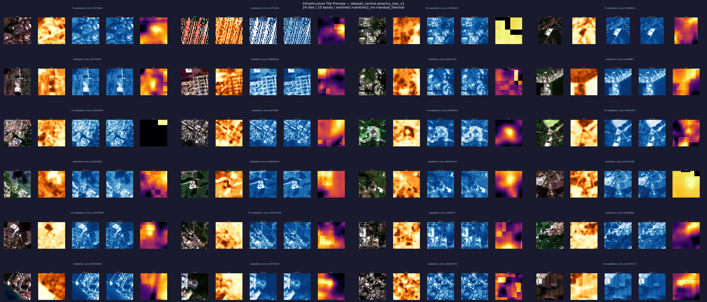

# Towards an Infrastructure Foundation Model (TIF-M)

A domain-specific pretrained encoder for critical infrastructure assets, trained on multimodal satellite imagery with weak labels from OpenStreetMap.

The project tests a specific hypothesis: that self-supervised pretraining on a globally distributed corpus of weakly labeled infrastructure imagery produces representations that transfer to downstream infrastructure tasks better than supervised training from scratch on local data alone. The current implementation is **power-first** (substations specifically), with the pipeline and ontology designed to extend toward the water/sewer, transport, and telecom sectors.

This is a step toward a foundation model, not a claim of one.

---

## Headline result

Self-supervised pretraining (SimCLR + ResNet-18) on a globally distributed corpus of 84,305 multimodal Sentinel-1 + Sentinel-2 tiles substantially outperforms supervised training from scratch on the same 3-class substation classification task.

| Pretraining scope | Mode | Tail-mean val acc | Tail std |
|---|---|---|---|
| Random init (no pretraining) | Fine-tuned | 0.336 | 0.116 |
| Single-region (Central America, 1,782 tiles) | Linear probe | 0.447 | 0.084 |
| Multi-continent (22,221 tiles, 4 continents) | Fine-tuned | 0.639 | 0.016 |
| **Global (84,305 tiles, 7 continents)** | **Fine-tuned** | **0.684** | **0.007** |

Tail mean is the average validation accuracy across the last five epochs. It is the honest metric here — random init achieves high *best* val_acc through lucky checkpoints while collapsing to majority-class prediction across most of training. Stability (low tail std) reflects whether the encoder learned a useful representation or got lucky.

Global pretraining improves over multi-continent by +4.5 percentage points of tail mean while cutting variance roughly in half. More data and more geographic diversity both contribute.

---

## Dataset preview



24 tiles from the curated Central America dataset, showing the full 10-band multimodal stack (Sentinel-2 RGB + NIR, Sentinel-1 SAR VV/VH, Landsat thermal) for transmission, distribution, and untyped substations. The current production pipeline uses 9 bands (Landsat thermal dropped for cross-region consistency); the Central America v1 dataset retains thermal as a historical artifact.

Central America was used simply because it is the smallest file size of the 7 continental regions, yielding the dataset preview the quickest. The assets chosen are not representative of the entire data corpus.

Additional preview figures in [`additional_info/figures/`](additional_info/figures/):
- `maine_tiles_trimodal.png` — 16 Maine tiles with the full trimodal stack (S2 + SAR + Landsat thermal), used during Maine development to validate modality alignment.
- `maine_tiles_sar_s2.png` — 16 Maine tiles with the production 9-band stack (S2 + SAR only), reflecting the current cross-region configuration.

---

## What this repository does

1. **Extracts** infrastructure assets from GeoFabrik OSM PBF files using a 2-pass power-only pre-filter.
2. **Deduplicates** spatially proximate assets via KDTree (200 m threshold per asset type).
3. **Fetches** multimodal imagery tiles from Microsoft Planetary Computer (Sentinel-2 multispectral + Sentinel-1 SAR; Landsat thermal and NAIP available as optional non-fatal modalities).
4. **QC + triage** filters tiles for valid pixel ratio, edge artifacts, and value range.
5. **Assembles** accepted tiles into curated `.npy` datasets with COCO-style manifests.
6. **Pretrains** a ResNet-18 encoder via SimCLR self-supervised contrastive learning.
7. **Evaluates** learned representations on downstream asset classification.

Cross-sector co-location prediction is on the roadmap but not currently implemented — see [roadmap](#roadmap).

---

## Repository structure

```
curation/                         # Local / VSCode-side
  sources.py                      #   OSM extraction (pyosmium, NodeLocationsForWays)
  ontology.py                     #   Multi-sector asset class registry
  deduplication.py                #   BallTree+haversine spatial dedup
  stac_imagery.py                 #   Planetary Computer fetcher
  qc.py                           #   Quality control checks
  triage.py                       #   Rule-based confidence scoring
  dataset.py                      #   Dataset assembly (manifest + .npy tiles)
  pipeline.py                     #   End-to-end orchestration with checkpointing
  run_pipeline_from_collapsed_assets.py  #   Batch regional runner
  extract_substations_all.py      #   Batch substation extraction from power-only PBFs
  sample_europe_substations.py    #   Sample Europe down to match Asia tile count
  sample_north_america_substations.py    #   Sample NA down to match Asia tile count
  diagnose_stac.py                #   STAC fetcher diagnostic tool
  visualize_tiles.py              #   Visual inspection of curated tiles
  stac_imagery_test.py            #   Single-tile integration test
  helpers/tile_types.py           #   Shared TileResult, MODALITY_REGISTRY
  utils/io_utils.py               #   load_asset_table and related IO helpers
  requirements.txt                #   Curation-side Python dependencies

pretraining/                      # Imported by Colab notebooks
  train.py                        #   SimCLR pretraining loop with cosine LR + resume
  datasets.py                     #   InfrastructureImageDataset
  augmentations.py                #   Multimodal-aware augmentations (no value jitter on SAR)
  losses.py                       #   NT-Xent contrastive loss
  config.py                       #   Run config dataclass + serialization

downstream/                       # Imported by Colab notebooks
  common/
    models.py                     #   EncoderBackbone, SimCLRModel (canonical), LinearClassifier
    comm_datasets.py              #   NpyInfrastructureDataset
    transforms.py                 #   MultimodalResize, MultimodalAugment
    io.py                         #   resolve_path, parse_asset_id_from_filename
    utils.py                      #   set_seed, choose_device, save_checkpoint
  asset_classification/
    datasets.py                   #   AssetClassificationDataset, LabelSpace
    train.py                      #   Classification training with tail metrics

colab_notebooks/                  # Run in Google Colab, import from packages above
  infra_fm_stac_fetch.ipynb       #   STAC imagery fetch for new regions
  infra_fm_multicontinent_pretrain.ipynb  #   Pretraining (resumable)
  infra_fm_global_classification.ipynb    #   Downstream classification
  ...

additional_info/
  ONTOLOGY.md                     # Power asset taxonomy and OSM tag mappings

data/                             # Local data (gitignored)
  pbf/power_only/                 # Pre-filtered power-only PBFs (regenerable cache)
  PIPELINE/                       # Intermediate parquets (extracted, deduped)
  curated_datasets/               # Final .npy datasets + manifests
  results/                        # Local pretraining / classification outputs

testing/                          # Integration tests and debug scripts
```

---

## Workflow

The project uses a split execution model:

**Curation runs locally in VSCode.** The curation pipeline is CPU-bound, involves long-running jobs over continental PBF files (tens of GB), and benefits from IDE tooling for iterative debugging. It produces curated `.npy` datasets stored under `data/curated_datasets/`.

**Pretraining and classification run in Google Colab.** These are GPU-bound and well-encapsulated in single notebooks. The Colab notebooks import from this repo's `pretraining/` and `downstream/` packages — the notebooks are thin orchestration layers; the actual code lives here. Datasets flow VSCode → Google Drive → Colab.

```
   VSCode (local)              Google Drive                    Colab
┌──────────────────┐         ┌──────────────┐         ┌──────────────────┐
│  curation/       │ ─────►  │  datasets/   │ ─────►  │  pretraining/    │
│  pipeline.py     │  zip    │  *.zip       │  copy   │  classification  │
│  PBF → tiles     │ + push  │              │ /unzip  │  notebooks       │
└──────────────────┘         └──────────────┘         └──────────────────┘
                                                              │
                                                              ▼
                                                      checkpoints to Drive
```

### Dataset transfer pattern (Drive → Colab)

Mounted Google Drive is slow for the many-small-files pattern that satellite tiles produce. The reliable pattern is to zip each regional dataset, upload the zip to Drive, then in Colab copy the zip to local `/content/` storage and unzip there. One large transfer is dramatically faster than tens of thousands of small file reads through the Drive mount.

```python
# In Colab, after mounting Drive:
import glob, subprocess, os

ZIP_SOURCE = '/content/drive/MyDrive/infra_fm/datasets'
DEST = '/content'

for zip_path in glob.glob(f'{ZIP_SOURCE}/*.zip'):
    name = os.path.basename(zip_path)
    if not os.path.exists(f'{DEST}/{name}'):
        subprocess.run(['cp', zip_path, DEST], check=True)

for f in glob.glob(f'{DEST}/*.zip'):
    folder = f.replace('.zip', '')
    if not os.path.exists(folder):
        subprocess.run(['unzip', '-q', f, '-d', DEST], check=True)
```

Training and classification then point at `/content/dataset_<region>_stac_v1/` paths, not Drive paths.

---

## Setup

### Local environment (curation)

```bash
uv venv
source .venv/bin/activate
uv pip install -r curation/requirements.txt
```

Core dependencies include `osmium`, `pyosmium`, `scipy`, `rasterio`, `pystac-client`, `planetary-computer`, `polars` (preferred over pandas for large parquets), `numpy`, and `matplotlib`.

### Colab environment (pretraining + classification)

The Colab notebooks handle their own setup. They clone or extract this repository under `/content/`, install PyTorch and torchvision (preinstalled on Colab), and import from the local copy. See the first few cells of any pretraining or classification notebook for the canonical setup sequence.

The Colab notebooks pull this repository directly from GitHub each session. Setup is one-time per Colab user:

1. **Generate a GitHub Personal Access Token (PAT):**
   - GitHub → Settings → Developer settings → Personal access tokens → Fine-grained tokens → Generate new token
   - Repository access: select this repository only
   - Permissions: Contents → Read-only
   - Expiration: 90 days (or longer; you'll need to regenerate when it expires)
   - Copy the token immediately — GitHub only shows it once

2. **Store the PAT in Colab Secrets:**
   - In any Colab notebook, click the key icon in the left sidebar
   - Add a secret named `GITHUB_TOKEN`
   - Paste the token value
   - Toggle "Notebook access" on

3. **Verify it works** by running the setup cell at the top of any notebook in `colab_notebooks/`. The cell clones the repo into `/content/infra_fm_clean/` and adds it to the Python path.

The token is never written to the notebook itself — it's read from Colab's secret store at runtime.

When this repository is made public (post-paper-submission), the PAT step becomes unnecessary; the clone command works without authentication.

---

## Running the curation pipeline

Edit the configuration block at the top of `pipeline.py` to set paths and modalities, then:

```bash
# Dry run — verifies counts and configuration without fetching imagery
python pipeline.py --dry-run

# Full run
python pipeline.py
```

For batch processing across multiple regions, use the orchestrator:

```bash
python run_pipeline_from_collapsed_assets.py
```

This auto-skips regions with existing `_SUCCESS` markers and re-runs only when the filter preset has changed.

### Filter preset

The recommended preset is `"substation"`, which extracts:
- `energy.transmission.substation` (high confidence)
- `energy.distribution.substation` (high confidence)
- `energy.distribution.substation_untyped` (medium confidence — `power=substation` with no subtype)

The full power-sector preset (`"full"`) also pulls solar farms, wind farms, power plants, and generators, but is not the current paper scope.

### Sharded runs

For parallel runs across machines, `pipeline.py` supports:

```bash
python pipeline.py --shard-count 4 --shard-index 0 --shard-strategy spatial
```

Spatial sharding uses Z-order (Morton) curve interleaving for geographic coherence within shards.

---

## Dataset layout

Curated regional datasets are written under `data/curated_datasets/`:

```
data/curated_datasets/dataset_<region>_stac_v1/
├── images/
│   ├── osm_node_<id>_stac_sentinel2_ms+sentinel1.npy          # (C, H, W) array
│   ├── osm_way_<id>_stac_sentinel2_ms+sentinel1.npy
│   └── ...
├── manifest.json                  # Full per-tile metadata
├── summary.csv                    # Lightweight tabular summary
└── _SUCCESS                       # Completion marker with run metadata
```

Image arrays for the current substation pipeline are 9 bands: Sentinel-2 multispectral bands 0–6, then Sentinel-1 VV + VH bands 7–8. Landsat thermal (band 9 in older Central America tiles) was dropped for cross-region consistency.

---

## Roadmap

**Near-term (current paper scope):**
- Resolve the Asia yield gap. Diagnostic work has identified that the 9% yield in the China + Southeast Asia longitude band is concentrated in China specifically (5% yield at temperate Chinese latitudes vs. 24% in equatorial SE Asia), inconsistent with a cloud-cover hypothesis and most likely reflecting Sentinel-2 L2A coverage gaps over China during the fetch window.
- Code review and refactoring for scalability to additional asset types and infrastructure sectors.
- Paper drafting targeting end of July 2026.

**Longer-term:**
- Expand to the full power ontology (generators, power plants, solar/wind farms at scale) once substations are complete globally.
- Cross-sector co-location prediction (substations near roads, water, telecom) — requires non-power OSM extraction not yet implemented in the curation pipeline.
- Higher-resolution imagery integration: Maxar 30cm via NASA CSDA program.
- MAE pretraining as an alternative to SimCLR; ViT backbones as an alternative to ResNet-18.
- Multisector ontology extension (water/sewer, transport, telecom) — drafted in `ONTOLOGY.md`.

---

## Known quirks and gotchas

Project-specific knowledge that's saved hours and will save hours again:

**"Ways scanned: 0" in `sources.py` progress logs is normal.** `NodeLocationsForWays` processes all nodes first to build a location index, then resolves ways in a second internal pass. The way-scanning count doesn't update during the first pass.

**The SimCLR encoder loading bug.** When loading a pretrained SimCLR checkpoint for downstream classification, `EncoderBackbone` must use `net.fc = nn.Identity()` + `self.backbone = net`, not `nn.Sequential(*list(net.children())[:-1])`. The Sequential pattern produces key names like `backbone.encoder.conv1.weight` that don't match the checkpoint's `backbone.conv1.weight`, causing silent random initialization with `strict=False`. Always verify that `model.load_state_dict(...)` reports zero missing keys before trusting classification results.

**Planetary Computer is unreliable from home wifi.** Residential NAT and ISP throttling cause sporadic failures at scale. Use campus / institutional network for large fetches.

**Large parquets cause Colab RAM issues.** Load only the columns you need:
```python
df = pd.read_parquet(path)[['asset_id', 'asset_type', 'lat', 'lon']].copy()
```

**Augmentations are modality-aware.** Spatial transforms (flip, rotation, random crop) apply to all bands. Value transforms (jitter, noise) apply only to optical bands (0–6), never to SAR or thermal — different value distributions, different statistical properties.

**Tail mean, not best val_acc.** Random init can achieve high *best* validation accuracy through lucky checkpoints while collapsing to majority-class prediction across the rest of training. The tail mean (average of last 5 epochs) plus tail std together reveal whether the encoder learned a generalizable representation.

**Solar farm deduplication looks aggressive but is correct.** OSM mappers often trace individual panel arrays within a single solar facility, producing many polygons within 200 m of each other. High dedup rates (~87% in Maine experiments) reflect the data, not a bug.

---

## Known dataset limitations

These are documented for paper readers and downstream users; they do not undermine the benchmark's methodology but should be reported explicitly.

**~2–3% extract undercount (May 2026).** The pyosmium `idx="sparse_file_array,locations.idx"` option silently dropped some node locations on certain inputs, causing the OSM extract to miss a small fraction of substations and to assemble fewer multipolygon areas than the source actually contained. The bug was identified in late May 2026 when transport extraction returned 1 airport instead of 88, and `sources.py` was patched to drop the `idx` parameter (commit history). The substation extract for central-america went from 1,870 → 1,920 (+2.6%) after the fix. The bug is uniform-random across regions and asset types, so class proportions and per-region representativeness are preserved. The existing imagery datasets correspond to extracts taken before the patch and are therefore mildly undercount; we chose not to re-extract globally because the cost (~19 h pre-filter compute) is not warranted for a 2–3% effect on a benchmark where F1 metrics are invariant to overall sample count.

**Substation subclass granularity.** The `energy.distribution.substation_minor` class (matching OSM `substation=minor_distribution`) is present in central-america's extract but not in the other regions' parquets, because the other regions' extracts predate the ontology update. For the Infra-Bench paper, all four substation subclasses are aggregated to a single "substations" label, so this asymmetry does not affect reported metrics.

**Imagery datasets are sample-capped.** The May 2026 STAC fetch capped at 25,000 tiles per region for compute reasons. For regions with more than 25,000 deduped substations (asia, north-america, europe), the on-disk imagery represents a subset of the deduped parquet. The `missing_from_dataset.csv` produced by `resync_dataset_manifest.py` lists every asset in the deduped parquet without a tile — for sample-capped regions, this is dominated by deliberately sampled-out assets, NOT bug recovery, and should not be fed verbatim into a refetch.

**KDTree latitude bug in pre-May-2026 dedup outputs.** Earlier deduplicated parquets were built with a scipy KDTree on raw (lat, lon) degree pairs and a `threshold / 111_320` conversion that only held at the equator. The fix swaps to sklearn BallTree+haversine, which is geographically correct. Per-region impact (substations) when re-deduping the same input: south-america −53 rows, australia-oceania −50, africa −34, north-america −310, asia −3,266 (largest, driven by high-latitude Russia/Siberia where the bug bit hardest). The current 02-deduped-assets parquets reflect the corrected dedup.

---

## Related work

The closest published work is Ye, Ward, De Plaen, and Koks (2025), "Big Earth Data" (DOI: 10.1080/20964471.2025.2490408), which trains supervised Faster R-CNN with ResNet-101 on WorldView-3 30 cm imagery over Vietnam to detect transmission towers and poles. The contributions are complementary:

- TIF-M is representation learning; Ye et al. is supervised object detection.
- TIF-M trains on freely available 10 m Sentinel imagery at global scale; Ye et al. requires commercial 30 cm tasking.
- TIF-M uses weak OSM labels; Ye et al. uses manual annotation.
- TIF-M targets multi-sector transfer; Ye et al. targets a specific detection task.

---

## Authors

Lead author: Justin Guthrie
Advisor: Edward Oughton (George Mason University)
Collaborators: Jack Watson (Northeastern University, Enodia Inc.)